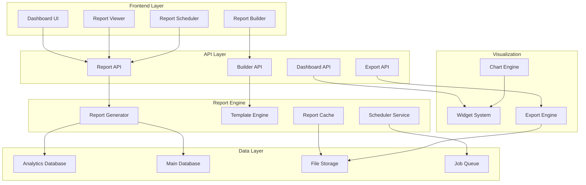
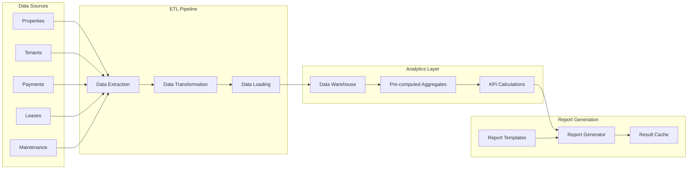

# Advanced Reporting System Design

## Overview

This design document outlines a comprehensive advanced reporting system for the Haven Property Management System. The system will provide interactive dashboards, customizable reports, automated scheduling, real-time analytics, and advanced data visualization capabilities. The architecture focuses on scalability, performance, and user experience while maintaining data integrity and security.

The design addresses eight key areas: financial reporting with interactive charts, automated report scheduling, real-time operational dashboards, tenant analytics, advanced data export, audit trail reporting, performance monitoring, and custom report building.

## Architecture

### High-Level Reporting Architecture



### Data Flow Architecture



## Components and Interfaces

### 1. Report Engine Core

**Purpose**: Central system for report generation, template management, and data processing.

**Key Components**:
- **Report Generator**: Processes report requests and generates output
- **Template Engine**: Manages report templates and customization
- **Data Processor**: Handles data aggregation and calculations
- **Cache Manager**: Optimizes performance through intelligent caching

**Interfaces**:
```typescript
interface ReportEngine {
  generateReport(template: ReportTemplate, filters: ReportFilters): Promise<Report>;
  createTemplate(definition: TemplateDefinition): Promise<ReportTemplate>;
  scheduleReport(schedule: ReportSchedule): Promise<ScheduledReport>;
  getCachedReport(cacheKey: string): Promise<Report | null>;
}

interface ReportTemplate {
  id: string;
  name: string;
  type: ReportType;
  dataSource: DataSourceConfig;
  layout: LayoutConfig;
  visualizations: VisualizationConfig[];
  filters: FilterConfig[];
  permissions: PermissionConfig;
}

interface ReportFilters {
  dateRange: DateRange;
  properties?: string[];
  tenants?: string[];
  categories?: string[];
  customFilters?: Record<string, any>;
}
```

### 2. Dashboard System

**Purpose**: Provides real-time interactive dashboards with customizable widgets.

**Key Components**:
- **Widget Manager**: Handles dashboard widget lifecycle
- **Real-time Data Service**: Provides live data updates
- **Layout Manager**: Manages dashboard layout and customization
- **Alert System**: Monitors thresholds and triggers notifications

**Interfaces**:
```typescript
interface DashboardSystem {
  createDashboard(config: DashboardConfig): Promise<Dashboard>;
  addWidget(dashboardId: string, widget: WidgetConfig): Promise<Widget>;
  updateWidget(widgetId: string, data: any): Promise<void>;
  subscribeTo(widgetId: string, callback: DataUpdateCallback): void;
}

interface Widget {
  id: string;
  type: WidgetType;
  title: string;
  dataSource: DataSourceConfig;
  visualization: VisualizationConfig;
  refreshInterval: number;
  filters: FilterConfig[];
  alerts: AlertConfig[];
}

interface DashboardConfig {
  name: string;
  layout: LayoutConfig;
  widgets: WidgetConfig[];
  permissions: PermissionConfig;
  refreshInterval: number;
}
```

### 3. Report Builder

**Purpose**: Drag-and-drop interface for creating custom reports without technical knowledge.

**Key Components**:
- **Visual Builder**: Drag-and-drop interface components
- **Data Source Explorer**: Browse and select available data
- **Preview Engine**: Real-time report preview
- **Template Manager**: Save and manage custom templates

**Interfaces**:
```typescript
interface ReportBuilder {
  getDataSources(): Promise<DataSource[]>;
  previewReport(definition: ReportDefinition): Promise<ReportPreview>;
  saveTemplate(template: TemplateDefinition): Promise<ReportTemplate>;
  validateDefinition(definition: ReportDefinition): ValidationResult;
}

interface ReportDefinition {
  dataSources: DataSourceSelection[];
  fields: FieldSelection[];
  groupBy: GroupByConfig[];
  aggregations: AggregationConfig[];
  filters: FilterConfig[];
  sorting: SortConfig[];
  visualization: VisualizationConfig;
}

interface DataSource {
  id: string;
  name: string;
  description: string;
  fields: DataField[];
  relationships: RelationshipConfig[];
}
```

### 4. Visualization Engine

**Purpose**: Renders charts, graphs, and interactive visualizations for reports and dashboards.

**Key Components**:
- **Chart Renderer**: Creates various chart types (bar, line, pie, etc.)
- **Table Generator**: Generates interactive data tables
- **Map Visualizer**: Geographic data visualization
- **Custom Visualizations**: Extensible visualization framework

**Interfaces**:
```typescript
interface VisualizationEngine {
  renderChart(config: ChartConfig, data: any[]): Promise<ChartResult>;
  renderTable(config: TableConfig, data: any[]): Promise<TableResult>;
  renderMap(config: MapConfig, data: any[]): Promise<MapResult>;
  registerCustomVisualization(type: string, renderer: VisualizationRenderer): void;
}

interface ChartConfig {
  type: ChartType;
  xAxis: AxisConfig;
  yAxis: AxisConfig;
  series: SeriesConfig[];
  styling: StyleConfig;
  interactions: InteractionConfig;
}

interface VisualizationRenderer {
  render(data: any[], config: any): Promise<VisualizationResult>;
  validate(config: any): ValidationResult;
  getConfigSchema(): JSONSchema;
}
```

### 5. Export System

**Purpose**: Handles report export in multiple formats with advanced formatting options.

**Key Components**:
- **PDF Generator**: High-quality PDF report generation
- **Excel Exporter**: Advanced Excel export with formatting
- **CSV Processor**: Optimized CSV export for large datasets
- **API Exporter**: Programmatic data access via REST API

**Interfaces**:
```typescript
interface ExportSystem {
  exportToPDF(report: Report, options: PDFOptions): Promise<ExportResult>;
  exportToExcel(report: Report, options: ExcelOptions): Promise<ExportResult>;
  exportToCSV(report: Report, options: CSVOptions): Promise<ExportResult>;
  exportToAPI(report: Report, format: APIFormat): Promise<APIExportResult>;
}

interface ExportOptions {
  format: ExportFormat;
  includeCharts: boolean;
  includeMetadata: boolean;
  compression: boolean;
  password?: string;
  watermark?: WatermarkConfig;
}

interface ExportResult {
  fileId: string;
  filename: string;
  size: number;
  downloadUrl: string;
  expiresAt: Date;
}
```

### 6. Scheduler Service

**Purpose**: Manages automated report generation and delivery.

**Key Components**:
- **Cron Manager**: Handles scheduled job execution
- **Delivery Service**: Email and notification delivery
- **Retry Logic**: Failed delivery retry mechanism
- **Status Tracking**: Delivery status monitoring

**Interfaces**:
```typescript
interface SchedulerService {
  createSchedule(config: ScheduleConfig): Promise<ReportSchedule>;
  updateSchedule(scheduleId: string, config: ScheduleConfig): Promise<void>;
  deleteSchedule(scheduleId: string): Promise<void>;
  getScheduleStatus(scheduleId: string): Promise<ScheduleStatus>;
}

interface ScheduleConfig {
  reportTemplate: string;
  cronExpression: string;
  recipients: RecipientConfig[];
  exportFormat: ExportFormat;
  filters: ReportFilters;
  deliveryOptions: DeliveryOptions;
}

interface RecipientConfig {
  email: string;
  name: string;
  role: string;
  customFilters?: ReportFilters;
}
```

## Data Models

### Report Template Model

```typescript
interface ReportTemplate {
  id: string;
  name: string;
  description: string;
  type: ReportType;
  category: string;
  createdBy: string;
  createdAt: Date;
  updatedAt: Date;
  isPublic: boolean;
  definition: ReportDefinition;
  permissions: PermissionConfig;
  usage: UsageStats;
}
```

### Dashboard Model

```typescript
interface Dashboard {
  id: string;
  name: string;
  description: string;
  ownerId: string;
  agencyId: string;
  layout: LayoutConfig;
  widgets: Widget[];
  permissions: PermissionConfig;
  isDefault: boolean;
  createdAt: Date;
  updatedAt: Date;
}
```

### Scheduled Report Model

```typescript
interface ScheduledReport {
  id: string;
  name: string;
  templateId: string;
  ownerId: string;
  agencyId: string;
  schedule: ScheduleConfig;
  lastRun: Date;
  nextRun: Date;
  status: ScheduleStatus;
  deliveryHistory: DeliveryRecord[];
  createdAt: Date;
  updatedAt: Date;
}
```

### Analytics Data Model

```typescript
interface AnalyticsData {
  id: string;
  agencyId: string;
  dataType: string;
  period: string;
  metrics: Record<string, number>;
  dimensions: Record<string, string>;
  timestamp: Date;
  version: number;
}
```

## Error Handling

### Report Generation Errors

1. **Data Access Errors**
   - Database connection failures
   - Permission denied errors
   - Data source unavailable

2. **Template Errors**
   - Invalid template configuration
   - Missing required fields
   - Circular dependencies

3. **Performance Errors**
   - Query timeout errors
   - Memory limit exceeded
   - Export size limits

### Error Handling Strategy

```typescript
interface ReportErrorHandler {
  handleDataError(error: DataError): ReportError;
  handleTemplateError(error: TemplateError): ReportError;
  handlePerformanceError(error: PerformanceError): ReportError;
  retryGeneration(reportId: string, maxRetries: number): Promise<Report>;
}
```

### Graceful Degradation

```typescript
interface GracefulDegradation {
  fallbackToCache(reportId: string): Promise<Report | null>;
  generatePartialReport(template: ReportTemplate, availableData: any[]): Promise<PartialReport>;
  notifyUserOfLimitations(userId: string, limitations: string[]): Promise<void>;
}
```

## Testing Strategy

### Unit Testing

1. **Report Engine Testing**
   - Template processing validation
   - Data aggregation accuracy
   - Filter application correctness
   - Cache behavior verification

2. **Visualization Testing**
   - Chart rendering accuracy
   - Data binding correctness
   - Interactive feature functionality
   - Cross-browser compatibility

3. **Export Testing**
   - Format-specific output validation
   - Large dataset handling
   - File integrity verification
   - Performance benchmarking

### Integration Testing

1. **End-to-End Report Generation**
   - Complete report lifecycle testing
   - Multi-user concurrent access
   - Real-time data integration
   - Scheduled report delivery

2. **Dashboard Integration**
   - Widget interaction testing
   - Real-time update verification
   - Layout responsiveness
   - Performance under load

### Performance Testing

1. **Load Testing**
   - Concurrent report generation
   - Large dataset processing
   - Dashboard real-time updates
   - Export performance

2. **Scalability Testing**
   - Multi-tenant data isolation
   - Resource usage optimization
   - Cache effectiveness
   - Database query performance

## Security Considerations

### Data Access Control

1. **Role-Based Permissions**
   - Report template access control
   - Data source restrictions
   - Export limitations
   - Dashboard sharing controls

2. **Data Privacy**
   - Tenant data isolation
   - PII data masking
   - Audit trail logging
   - Compliance reporting

### Export Security

1. **File Security**
   - Password-protected exports
   - Watermarking capabilities
   - Temporary file cleanup
   - Access logging

2. **API Security**
   - Rate limiting for API exports
   - Authentication requirements
   - Data sanitization
   - Request logging

## Implementation Phases

**Phase 1: Core Report Engine (Week 1-2)**
- Implement basic report generation
- Create template system
- Set up data processing pipeline
- Add caching layer

**Phase 2: Dashboard System (Week 2-3)**
- Build widget framework
- Implement real-time updates
- Create dashboard management
- Add alert system

**Phase 3: Report Builder (Week 3-4)**
- Develop drag-and-drop interface
- Implement data source explorer
- Add preview functionality
- Create template management

**Phase 4: Advanced Features (Week 4-5)**
- Add export capabilities
- Implement scheduling system
- Create audit trail reporting
- Add performance monitoring

**Phase 5: Visualization & Polish (Week 5-6)**
- Enhance chart capabilities
- Improve user interface
- Add advanced analytics
- Performance optimization

## Success Metrics

- Report generation time reduced by 70%
- Dashboard load time <2 seconds
- Support for 50+ concurrent report generations
- 99.9% scheduled report delivery success rate
- User adoption rate >80% within 3 months
- Export processing time <30 seconds for large datasets