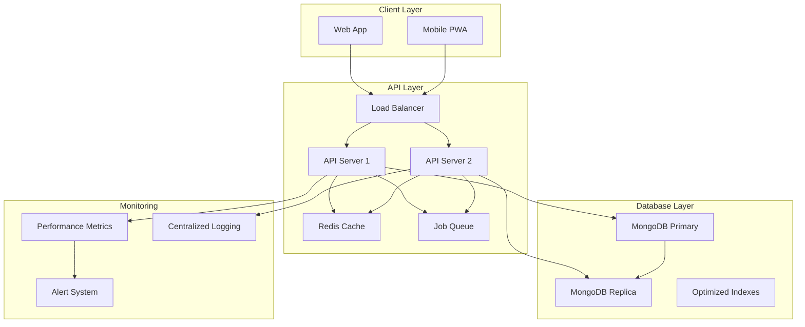
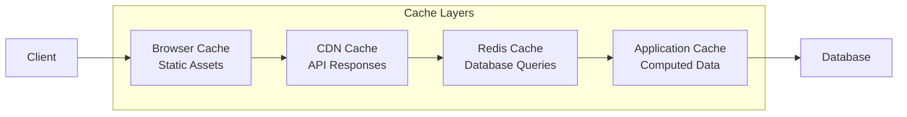

# Performance & Scalability Optimization Design

## Overview

This design document outlines a comprehensive performance optimization strategy for the Haven Property Management System. The approach focuses on database optimization, caching strategies, query performance, memory management, and monitoring to ensure the system can scale efficiently while maintaining excellent user experience.

The design addresses six key areas: dashboard performance, database optimization, payment processing reliability, efficient data exports, high-traffic handling, and comprehensive monitoring.

## Architecture

### High-Level Performance Architecture



### Caching Strategy



## Components and Interfaces

### 1. Database Optimization Layer

**Purpose**: Optimize database queries, implement proper indexing, and manage connections efficiently.

**Key Components**:
- **Index Manager**: Manages database indexes for optimal query performance
- **Connection Pool Manager**: Handles database connection lifecycle
- **Query Optimizer**: Analyzes and optimizes database queries
- **Bulk Operation Handler**: Processes large datasets efficiently

**Interfaces**:
```typescript
interface DatabaseOptimizer {
  createIndexes(): Promise<void>;
  optimizeQuery(query: DatabaseQuery): OptimizedQuery;
  executeBulkOperation(operation: BulkOperation): Promise<BulkResult>;
  getConnectionPoolStats(): ConnectionPoolStats;
}

interface IndexStrategy {
  propertyIndexes: IndexDefinition[];
  tenantIndexes: IndexDefinition[];
  paymentIndexes: IndexDefinition[];
  compoundIndexes: IndexDefinition[];
}
```

### 2. Caching Layer

**Purpose**: Implement multi-level caching to reduce database load and improve response times.

**Key Components**:
- **Redis Cache Manager**: Handles distributed caching
- **Cache Invalidation Service**: Manages cache expiration and updates
- **Cache Warming Service**: Pre-loads frequently accessed data
- **Cache Analytics**: Monitors cache hit rates and performance

**Interfaces**:
```typescript
interface CacheManager {
  get<T>(key: string): Promise<T | null>;
  set<T>(key: string, value: T, ttl?: number): Promise<void>;
  invalidate(pattern: string): Promise<void>;
  getStats(): CacheStats;
}

interface CacheStrategy {
  dashboardData: CacheConfig;
  propertyLists: CacheConfig;
  userSessions: CacheConfig;
  apiResponses: CacheConfig;
}
```

### 3. Performance Monitoring System

**Purpose**: Track system performance metrics and identify bottlenecks.

**Key Components**:
- **Metrics Collector**: Gathers performance data
- **Performance Analyzer**: Analyzes trends and identifies issues
- **Alert Manager**: Sends notifications for performance issues
- **Dashboard Generator**: Creates performance dashboards

**Interfaces**:
```typescript
interface PerformanceMonitor {
  trackApiResponse(endpoint: string, duration: number): void;
  trackDatabaseQuery(query: string, duration: number): void;
  trackMemoryUsage(usage: MemoryStats): void;
  generateReport(period: TimePeriod): PerformanceReport;
}

interface PerformanceMetrics {
  responseTime: number;
  throughput: number;
  errorRate: number;
  memoryUsage: number;
  cpuUsage: number;
}
```

### 4. Background Job Processing

**Purpose**: Handle long-running operations asynchronously to improve user experience.

**Key Components**:
- **Job Queue Manager**: Manages background job execution
- **Export Service**: Handles large data exports
- **Notification Service**: Sends job completion notifications
- **Progress Tracker**: Tracks job progress for user feedback

**Interfaces**:
```typescript
interface JobProcessor {
  enqueue(job: BackgroundJob): Promise<JobId>;
  getJobStatus(jobId: JobId): Promise<JobStatus>;
  cancelJob(jobId: JobId): Promise<void>;
  getJobHistory(userId: string): Promise<JobHistory[]>;
}

interface BackgroundJob {
  type: JobType;
  payload: any;
  priority: JobPriority;
  retryConfig: RetryConfig;
}
```

## Data Models

### Performance Metrics Model

```typescript
interface PerformanceMetric {
  id: string;
  timestamp: Date;
  endpoint: string;
  method: string;
  responseTime: number;
  statusCode: number;
  userId?: string;
  agencyId: string;
  memoryUsage: number;
  cpuUsage: number;
}
```

### Cache Configuration Model

```typescript
interface CacheConfig {
  key: string;
  ttl: number; // Time to live in seconds
  invalidationTriggers: string[];
  warmupStrategy: WarmupStrategy;
  compressionEnabled: boolean;
}
```

### Database Index Model

```typescript
interface DatabaseIndex {
  collection: string;
  fields: IndexField[];
  options: IndexOptions;
  createdAt: Date;
  lastUsed: Date;
  hitCount: number;
}
```

## Error Handling

### Performance Error Categories

1. **Timeout Errors**
   - Database query timeouts (>5 seconds)
   - API response timeouts (>30 seconds)
   - Cache operation timeouts (>1 second)

2. **Resource Exhaustion**
   - Memory usage >90%
   - Database connection pool exhaustion
   - Cache memory limits exceeded

3. **Performance Degradation**
   - Response times >3 seconds
   - Cache hit rate <70%
   - Database query performance degradation

### Error Handling Strategy

```typescript
interface PerformanceErrorHandler {
  handleTimeout(operation: string, duration: number): void;
  handleResourceExhaustion(resource: ResourceType): void;
  handlePerformanceDegradation(metric: PerformanceMetric): void;
  escalateIssue(issue: PerformanceIssue): void;
}
```

### Circuit Breaker Implementation

```typescript
interface CircuitBreaker {
  state: CircuitState; // CLOSED, OPEN, HALF_OPEN
  failureThreshold: number;
  timeout: number;
  execute<T>(operation: () => Promise<T>): Promise<T>;
  getStats(): CircuitBreakerStats;
}
```

## Testing Strategy

### Performance Testing Approach

1. **Load Testing**
   - Simulate 100 concurrent users
   - Test dashboard loading under load
   - Verify payment processing performance
   - Test bulk operations with large datasets

2. **Stress Testing**
   - Push system beyond normal capacity
   - Test memory usage under extreme load
   - Verify graceful degradation
   - Test recovery after stress conditions

3. **Database Performance Testing**
   - Query execution time benchmarks
   - Index effectiveness testing
   - Connection pool performance
   - Bulk operation efficiency

4. **Cache Performance Testing**
   - Cache hit rate optimization
   - Cache invalidation testing
   - Memory usage monitoring
   - Cache warming effectiveness

### Performance Benchmarks

```typescript
interface PerformanceBenchmarks {
  dashboardLoadTime: number; // <2 seconds
  apiResponseTime: number; // <500ms average
  databaseQueryTime: number; // <100ms average
  cacheHitRate: number; // >80%
  memoryUsage: number; // <70% of available
  concurrentUsers: number; // Support 500+
}
```

### Monitoring and Alerting

1. **Real-time Monitoring**
   - API response times
   - Database query performance
   - Memory and CPU usage
   - Cache performance metrics

2. **Alert Thresholds**
   - Response time >3 seconds
   - Memory usage >80%
   - Cache hit rate <70%
   - Database query time >1 second
   - Error rate >5%

3. **Performance Dashboards**
   - Real-time system metrics
   - Historical performance trends
   - Resource utilization graphs
   - Alert status and history

### Implementation Phases

**Phase 1: Database Optimization (Week 1-2)**
- Implement database indexes
- Optimize existing queries
- Set up connection pooling
- Add query performance monitoring

**Phase 2: Caching Implementation (Week 2-3)**
- Set up Redis cache
- Implement cache strategies
- Add cache invalidation logic
- Monitor cache performance

**Phase 3: Background Processing (Week 3-4)**
- Implement job queue system
- Move long-running operations to background
- Add progress tracking
- Implement notification system

**Phase 4: Monitoring and Optimization (Week 4-5)**
- Set up comprehensive monitoring
- Implement alerting system
- Performance testing and tuning
- Documentation and training

### Success Metrics

- Dashboard load time reduced by 60%
- API response times improved by 50%
- Database query performance improved by 70%
- System can handle 5x current user load
- Memory usage optimized by 40%
- 99.9% uptime maintained during peak usage